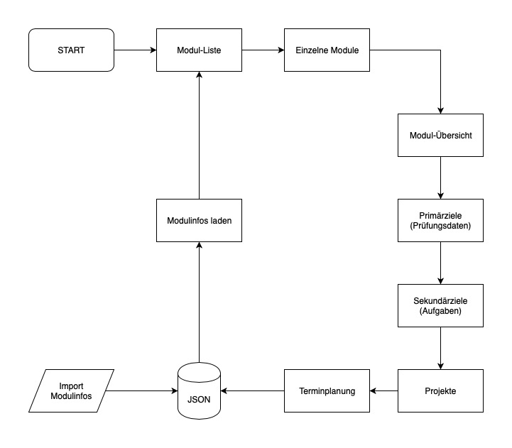

# Projekt-Idee: Webapplikation (ElProfessor)

## Abstract

Um die einzelnen Semester des Studiums erfolgreich abzuschliessen, ist eine möglichst effiziente und stressfreie Planung der Inhalte unabdingbar. Jedes Modul hat unterschiedliche Anforderungen und wird in einer anderen Form geprüft. Während der Bearbeitung der Themenblöcke sollten die Primärziele des Studiums stehts im Auge behalten und der Überblick über die verschiednen Deadlines niemals verloren werden.

## Projekt

Mittels einer Software werden die Module und deren wichtigste Inhalte auf einer Web-Oberfläche aufgezeigt. Zusätzlich können wichtige Infos und Daten den jeweiligen Modulen hinzugefügt werden. Zum Schluss können die wichtigsten Daten und Deadlines auf den Kalender exportiert werden.

## Anforderungen

* Importieren und speichern der Module und deren wichtigsten Inhalte (evtl. nur durch Eingabemaske möglich?)
* Hinzufügen von Informationen und persönlichen Notizen und Abspeicherung dieser
* Ausgabe der Deadlines und Terminplanung für den Kalender

## FLussdiagramm (Version 1.0)

