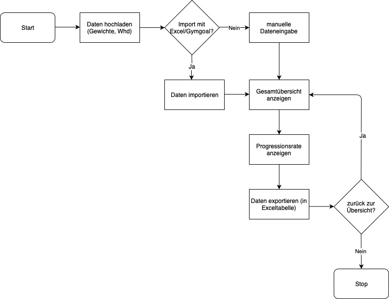

# Projekt-Idee: Webapplikation

## Progressionstracking

Die Progressionsrate und der gesamte Workload spielt im Krafttraining eine entscheidende Rolle. Die Progressionsrate gibt an, wie stark man sich im Laufe der Zeit steigern kann und zeigt somit den persönlichen Fortschritt (= Muskel- bzw. Kraftaufbau) auf. Der Workload ist das gesamte Trainingsvolumen (Gewicht x Wiederholungen x Anzahl Sätze) und ist der entscheidende Faktor für Progression. Um einen Überblick über diese zwei Grössen zu gewährleisten, werden sie in dieser App dokumentiert und mit vergangenen Werten verglichen, damit eine qualitative Aussage über den Trainingsstand und die Effektivität des derzeitigen Trainings gemacht werden kann.

