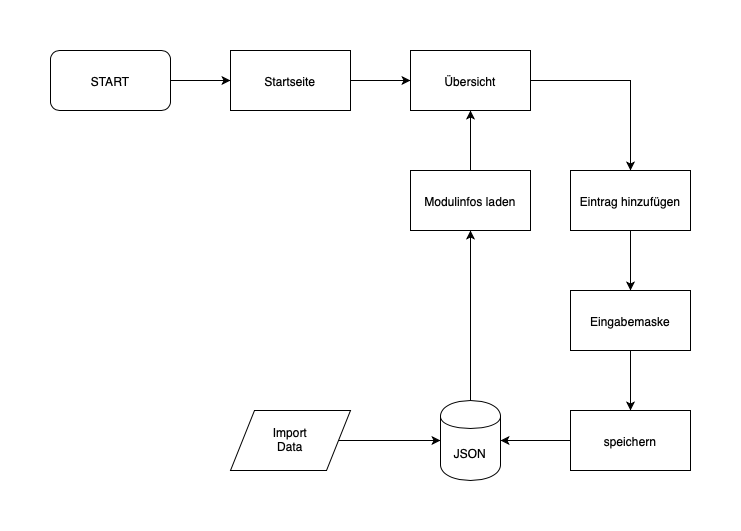

# Projekt-Idee: Webapplikation (El Professor)

## Abstract

Um die einzelnen Semester des Studiums erfolgreich abzuschliessen, ist eine möglichst effiziente und stressfreie Planung der Inhalte unabdingbar. Ausserdem ist es essenziell die wichtigsten Ziele nicht aus den Augen zu verlieren. Denn schlussendlich entscheiden wenige Tätigkeiten über das erfolgreiche abschliessen des Semesters. Diese Tätigkeiten haben meist die Form einer Abschlussprüfung, einer wichtigen Präsentation oder einer Projektarbeit. Diese Dinge sollten also mit oberster Priorität behandelt und nicht aus den Augen verloren werden.

## Projekt

Mittels einer Software können die wichtigsen Tätigkeiten innerhalb eines Semesters (Prüfungen, Präsentationen, Projekte) erfasst werden. Die Einträge werden über eine Eingabemaske getätigt und neben der Art des Eintrages können weitere Informationen erfasst werden. Alle Einträge werden kategorisch in einer Übersicht gespeichert und sind so schnell und einfach ersichtlich. Ausserdem variieren unterschiedliche Zitate auf der Startseite, um für zusätzliche Lernmotivation zu sorgen.

## Anforderungen

* Eingabe und Speicherung der wichtigsten Tätigkeiten (Prüfungen, Präsentationen, Projekte) innerhalb des Semesters mitthilfe einer Eingabemaske
* Sortieren der abgespeicherten Einträge in Kategorien
* Übersicht über alle wichtigen Einträge

## Flussdiagramm (Version 2.0)

